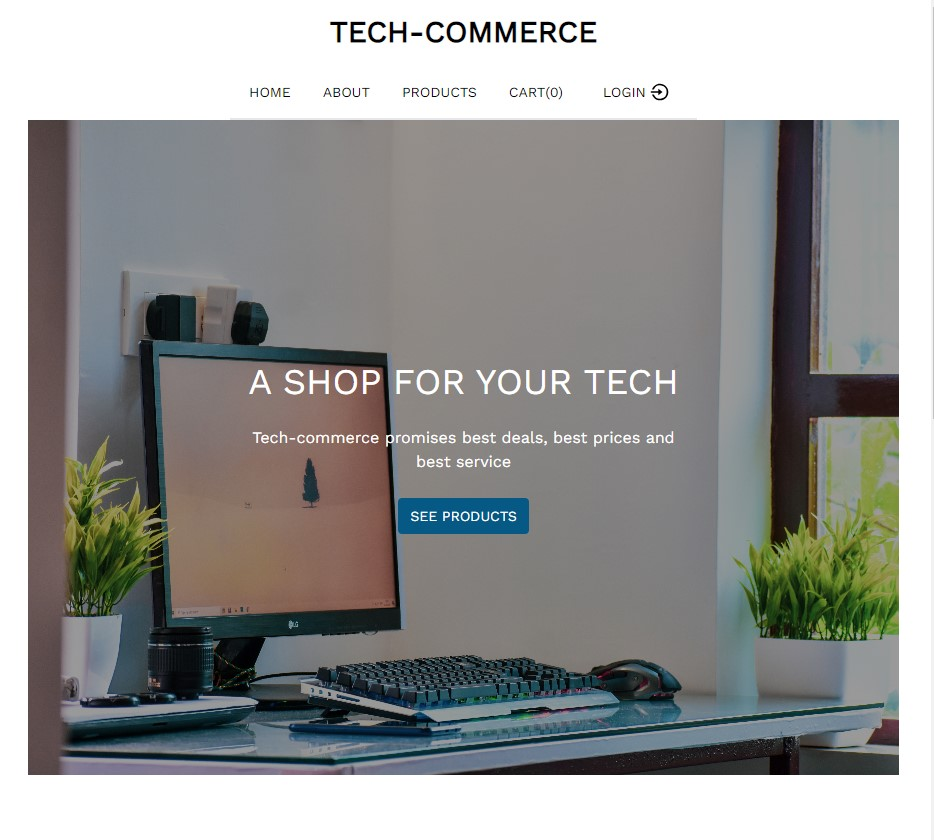
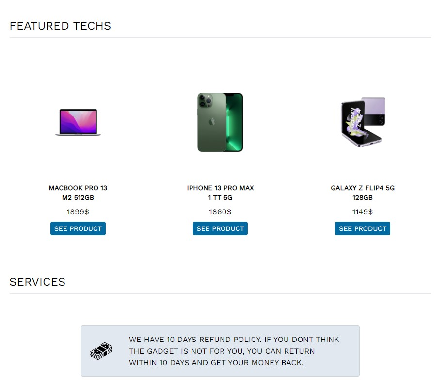
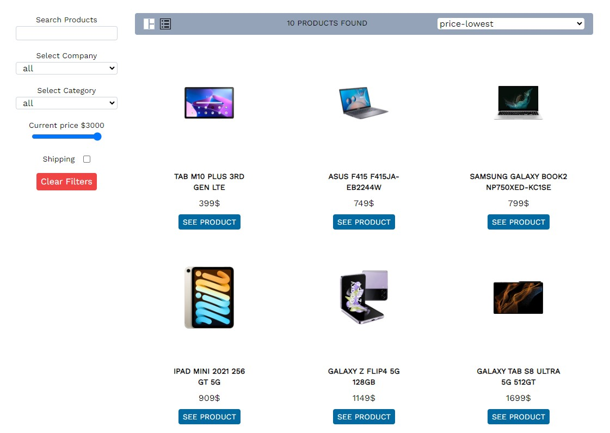
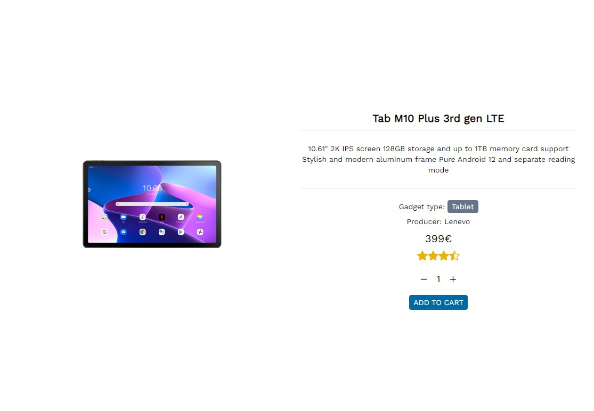

# TECH-COMMERCE

This is an online store for all the latest gadgets. It has all the functionalities of an e-commerce platform. Users will be able to select product, add products to cart, sort and filter products according to their desired specifications and checkout with their products to a payment gateway. It has simple and clean UI which is user friendly.

## Project Display


\
\

\
\

\
\


## Live Demo

[Tech_Commerce]()

## Built With

- VsCode
- React
- Context api
- Serverless static api
- tailwind

# Getting Started

To get a local copy of the repository please run the following commands on your terminal:

```bash

$ git clone `https://github.com/ajkacca457/techcommerce_front.git`
$ cd techcommerce_front
$ Run `npm install` to install the necessary modules.
$ Run `npm run start` to start client server.

```

# Limitations

- Right now running with serverless static api.
- Doesnt have a live link
- all the products are demo products

# Testing Project

To run test in your terminal:

```
$ Run `react-scripts test` to run basic tests for front-end

```

# Future development pipeline

To run test in your terminal:

- Creating backend with express and mongodb.
- Adding real products
- adding paytrail as payment getway.
- deploy to live domain

# Authors

👤 **Avijit Karmaker**

- Github: [@Avijit](https://github.com/ajkacca457)
- Linkedin: [@Avijit](https://www.linkedin.com/in/avijit-karmaker-8738a54)

## 🤝 Contributing

Contributions, issues and feature requests are welcome!

## Show your support

Give a ⭐️ if you like this project!

## Copyright

This is a project developed by Avijit.
