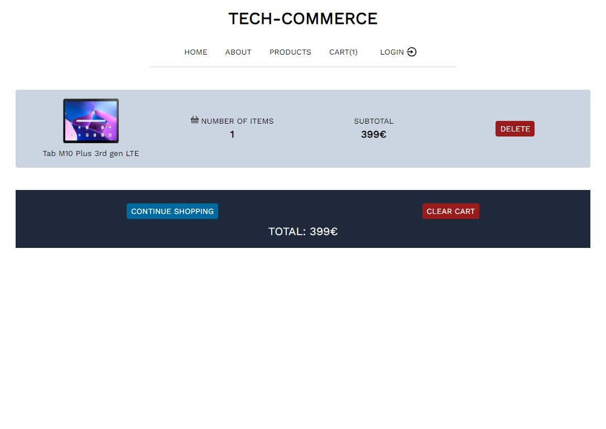

# TECH-COMMERCE

This is a online store for all the latest gadgets. This

## Project Display


\
\

\
\

\
\

\
\


## Live Demo

[Course_Tracker]()

## Built With

- VsCode
- React
- redux toolkit
- express
- MongoDB
- NodeJs
- Bootstrap

# Getting Started

To get a local copy of the repository please run the following commands on your terminal:

```bash

$ git clone `https://github.com/ajkacca457/course_tracker_restructure.git`
$ cd course_tracker_restructure
$ Run `npm install` to install the necessary modules for server and api.
$ create config.env file in env folder
$ Add the following variables in config.env file:
    - PORT (preferablly 5000 for backend server)
    - MONGO_URI (own connection string that for mongodb)
    - JWT_SECRET (it could be anything but it is preferable to use encryption key generator to get a good key)
    - JWT_EXPIRE (any range from 1h to 1y)
$ cd client
$ Run `npm install` to install node modules for front end.
$ Run `npm run dev` to start server.
$ Run `npm run start` to start client server.

```

# Limitations

- Right now the app doenst have a live link.

# Testing Project

To run test in your terminal:

```
$ No tests available for the backend codebase.
$ Run `react-scripts test` to run basic tests for front-end

```

# Future development pipeline

To run test in your terminal:

- Adding category and timeline based filtering to courses
- Adding advanced query options
- Pagination
- Adding option for user to generate pdf report/sharable link.
- deploy to live domain

# Authors

👤 **Avijit Karmaker**

- Github: [@Avijit](https://github.com/ajkacca457)
- Linkedin: [@Avijit](https://www.linkedin.com/in/avijit-karmaker-8738a54)

## 🤝 Contributing

Contributions, issues and feature requests are welcome!

## Show your support

Give a ⭐️ if you like this project!

## Copyright

This is a project developed by Avijit.

## Project Display


\
\

\
\

\
\

\
\

\
\


## Live Demo

[Course_Tracker]()

## Built With

- VsCode
- React
- redux toolkit
- express
- MongoDB
- NodeJs
- Bootstrap

# Getting Started

To get a local copy of the repository please run the following commands on your terminal:

```bash

$ git clone `https://github.com/ajkacca457/course_tracker_restructure.git`
$ cd course_tracker_restructure
$ Run `npm install` to install the necessary modules for server and api.
$ create config.env file in env folder
$ Add the following variables in config.env file:
    - PORT (preferablly 5000 for backend server)
    - MONGO_URI (own connection string that for mongodb)
    - JWT_SECRET (it could be anything but it is preferable to use encryption key generator to get a good key)
    - JWT_EXPIRE (any range from 1h to 1y)
$ cd client
$ Run `npm install` to install node modules for front end.
$ Run `npm run dev` to start server.
$ Run `npm run start` to start client server.

```

# Limitations

- Right now the app doenst have a live link.

# Testing Project

To run test in your terminal:

```
$ No tests available for the backend codebase.
$ Run `react-scripts test` to run basic tests for front-end

```

# Future development pipeline

To run test in your terminal:

- Adding category and timeline based filtering to courses
- Adding advanced query options
- Pagination
- Adding option for user to generate pdf report/sharable link.
- deploy to live domain

# Authors

👤 **Avijit Karmaker**

- Github: [@Avijit](https://github.com/ajkacca457)
- Linkedin: [@Avijit](https://www.linkedin.com/in/avijit-karmaker-8738a54)

## 🤝 Contributing

Contributions, issues and feature requests are welcome!

## Show your support

Give a ⭐️ if you like this project!

## Copyright

This is a project developed by Avijit.
